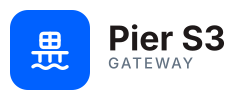

<p align="center">
  <picture>
    <source media="(prefers-color-scheme: dark)" srcset="docs/assets/logo-horizontal-dark.svg">
    
  </picture>
</p>

<p align="center"><em>The pier for your object storage.</em></p>

# Pier S3 Gateway

**Pier S3 Gateway** is an S3 proxy gateway with a web UI. It provides
authorized access to an S3-compatible object store (SeaweedFS) through Keycloak
OIDC: JWT verification, group/role-based ACL of the form `<bucket>-<ro|rw|wo>`
(plus `*` wildcard grants across all buckets), and proxying of S3 operations.

> 🌍 **Translations:** [Русский](docs/i18n/ru/README.md). The English README is
> the source of truth; localized copies live under [`docs/i18n/`](docs/i18n/).

## Requirements

- Go 1.22+
- Node.js 20+ / npm
- Docker & Docker Compose (for local development)
- kubectl + a Kubernetes cluster (for deployment)
- k6 (for load testing)

## Quick start

### 1. Install dependencies

```bash
# Go dependencies
go mod download

# Frontend dependencies
cd web && npm ci && cd ..
```

### 2. Build

```bash
# Full build (frontend + backend)
make all

# Or individually
make frontend     # Vite build → internal/webui/static
make backend-dev  # Go binary (without rebuilding the frontend)
```

### 3. Run the dev environment with Docker Compose

```bash
# Bring up SeaweedFS + Keycloak + the gateway
make dev-up

# Logs
make dev-logs

# Tear down
make dev-down
```

Once it is up:
- **Web UI**: http://localhost:8081
- **S3 Proxy**: http://localhost:8080
- **Keycloak Admin**: http://localhost:8180 (admin/admin)

### 4. Configure Keycloak

1. Open http://localhost:8180 (admin / admin)
2. Create a realm or use `master`
3. Create the client `s3-proxy` (Client Protocol: openid-connect)
4. Create a user and assign groups/roles of the form `<bucket>-<policy>`,
   where `<policy>` is one of `ro` (read), `rw` (read + write + delete) or
   `wo` (write-only / upload):
   - `reports-ro` - read access to the `reports` bucket
   - `dev-artifacts-rw` - read, write and delete in `dev-artifacts`
   - `uploads-wo` - upload-only to `uploads` (no listing/download/delete)
   - `*-ro` - read access to **every** bucket (wildcard; e.g. for an auditor)

> Full runbook for creating the realm / client / user (audience mapper,
> roles-vs-groups model, and the issuer/CORS/Vite-build gotchas):
> [docs/keycloak-setup.md](docs/keycloak-setup.md)

## Testing

```bash
# All tests
make test

# Go tests only
make test-go

# Tests with a coverage report
make test-go-cover

# Individual modules
make test-acl      # ACL resolver
make test-auth     # JWT/OIDC auth
make test-proxy    # S3 handler
make test-webui    # REST API
```

### Coverage targets

| Module          | Target coverage |
|-----------------|-----------------|
| internal/acl    | ≥ 90%           |
| internal/auth   | ≥ 85%           |
| internal/proxy  | ≥ 80%           |
| internal/webui  | ≥ 80%           |

## Docker

```bash
# Build the image
make docker

# Check the size (target: ≤ 30 MB)
make docker-size

# Run
make docker-run
```

## Kubernetes

### Helm (recommended)

```bash
helm install pier-s3-gateway ./deployments/helm/pier-s3-gateway \
  --namespace pier-s3-gateway --create-namespace \
  --set image.repository=registry.example.com/pier-s3-gateway \
  --set image.tag=v1.0.0 \
  --set ingress.s3Host=s3.example.com \
  --set ingress.uiHost=s3-ui.example.com
```

The chart parameterizes all of the manifests below (replicas/HPA, ingress
hosts + TLS, NetworkPolicy, PDB, resources, security context) and supports two
secret sources: External Secrets Operator (default) or a plain/pre-existing
Secret. See [`deployments/helm/pier-s3-gateway/README.md`](deployments/helm/pier-s3-gateway/README.md).

### Raw manifests

```bash
# Apply all manifests
make k8s-apply

# Check rollout status
make k8s-status

# Delete
make k8s-delete
```

### Manifests

| File | Description |
|------|-------------|
| deployment.yaml | 2 replicas, probes, resource limits, securityContext |
| service.yaml | ClusterIP: 8080 (S3) + 8081 (UI) |
| ingress.yaml | TLS via cert-manager, two hosts |
| secret.yaml | ExternalSecret (ESO) → Vault |
| networkpolicy.yaml | Ingress from Nginx, Egress to Keycloak + SeaweedFS |
| hpa.yaml | 2-10 replicas, target CPU 60% |
| pdb.yaml | minAvailable: 1 |

## Load testing

```bash
# k6: 500 RPS, 5 minutes, mixed GET/PUT
make load-test

# Or with parameters
k6 run -e BASE_URL=http://pier-s3-gateway.example.com -e AUTH_TOKEN=<jwt> tests/load/k6-script.js
```

Criteria: p99 latency ≤ 5ms (authorization overhead), error_rate < 0.1%

## Architecture

```
┌───────────────────────────────────────────────────┐
│                   Ingress (TLS)                   │
│pier-s3-gateway.example.com  s3-ui.example.com     │
└───────────┬───────────────────────┬───────────────┘
            │ :8080                 │ :8081
┌───────────▼───────────┐ ┌────────▼───────────────┐
│    S3 Proxy Handler   │ │    Web UI (React SPA)  │
│  JWT → ACL → Proxy    │ │  REST API + Static     │
└───────────┬───────────┘ └────────┬───────────────┘
            │                      │
    ┌───────▼──────────────────────▼──────┐
    │         internal/auth (JWKS)        │
    │         internal/acl (groups)       │
    └───────┬──────────────────┬──────────┘
            │                  │
    ┌───────▼──────┐   ┌──────▼───────┐
    │  SeaweedFS   │   │   Keycloak   │
    │  (S3 API)    │   │   (OIDC)     │
    └──────────────┘   └──────────────┘
```

## Project layout

```
├── cmd/server/main.go          # Entrypoint: two HTTP servers + graceful shutdown
├── internal/
│   ├── config/config.go        # Load configuration from env
│   ├── auth/
│   │   ├── keycloak.go         # JWKS JWT verification
│   │   ├── claims.go           # Extract username/groups from claims
│   │   └── oidc.go             # OIDC Authorization Code + PKCE
│   ├── acl/resolver.go         # Group parsing, ACL check, admin-op blocking
│   ├── proxy/
│   │   ├── s3client.go         # AWS SDK v2 client (SeaweedFS endpoint)
│   │   ├── rewrite.go          # Header rewriting
│   │   └── s3handler.go        # HTTP handler: auth → ACL → proxy
│   └── webui/
│       ├── auth.go             # Auth middleware, /auth/me, /auth/logout
│       ├── api.go              # REST API (buckets, objects CRUD)
│       ├── content_security.go # Response hardening (CSP, nosniff, type neutralization)
│       └── embed.go            # go:embed static, SPA fallback + CSP
├── web/                        # React 18 + TypeScript + Ant Design 5
│   └── src/
│       ├── auth/               # OIDC client (oidc-client-ts)
│       ├── api/client.ts       # Axios + Bearer interceptor
│       ├── store/              # Zustand (buckets, browser)
│       ├── theme/              # Theme presets (light/dark/system + code presets)
│       ├── i18n/               # UI translations (en default + ru/es/it/fr)
│       ├── components/         # BucketList, ObjectBrowser, FilePreview, ...
│       └── pages/              # Login, Buckets, Browser
├── deployments/
│   ├── Dockerfile              # Multi-stage: node → golang → distroless
│   └── k8s/                    # 7 manifests (Deployment, Service, Ingress, ...)
├── docs/                       # Documentation (English; translations in docs/i18n/)
├── tests/load/k6-script.js     # k6: 500 RPS load test
├── docker-compose.dev.yml      # Dev: SeaweedFS + Keycloak + gateway
└── Makefile                    # All build and test commands
```

## Documentation

- [API reference](docs/api.md)
- [Keycloak setup runbook](docs/keycloak-setup.md)
- Translations: [`docs/i18n/`](docs/i18n/)
